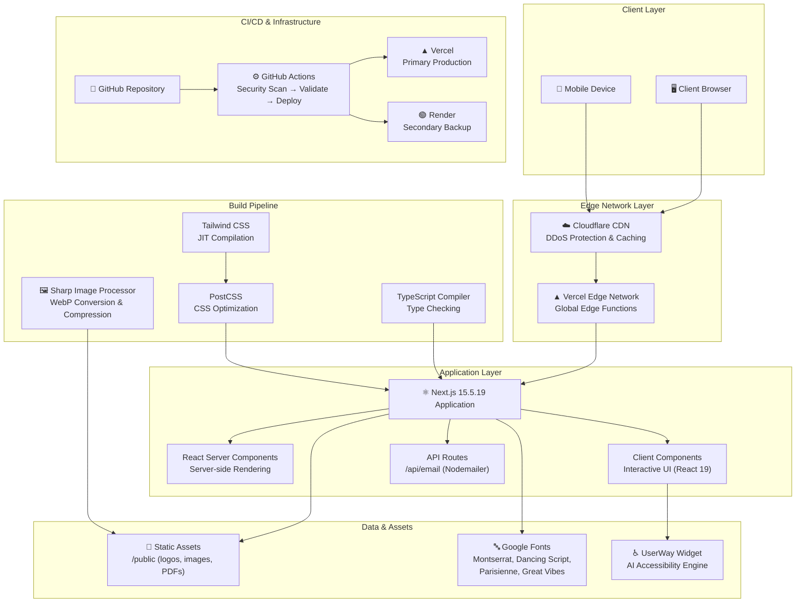
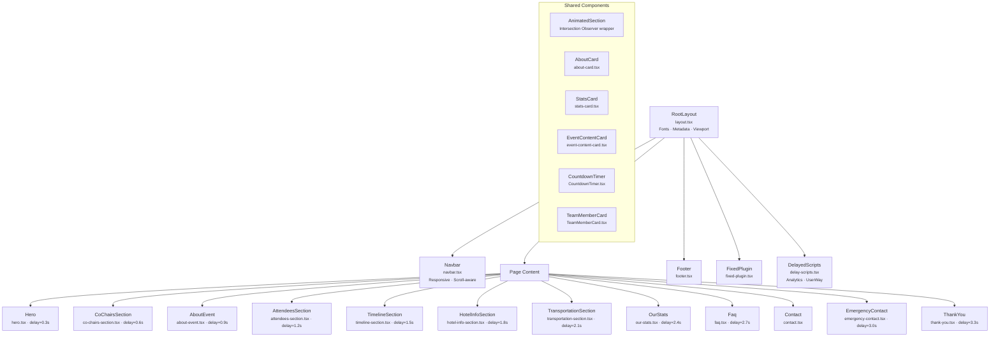
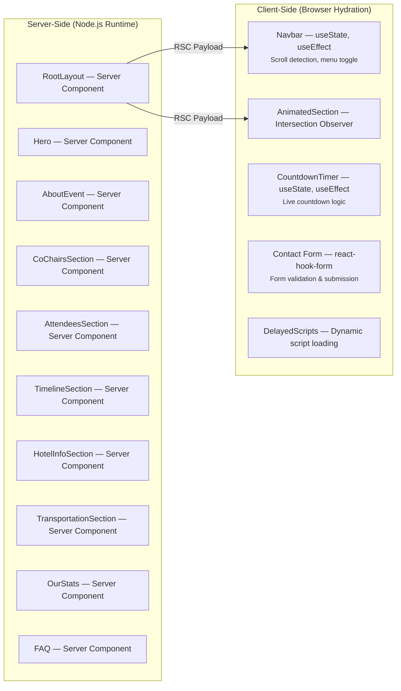
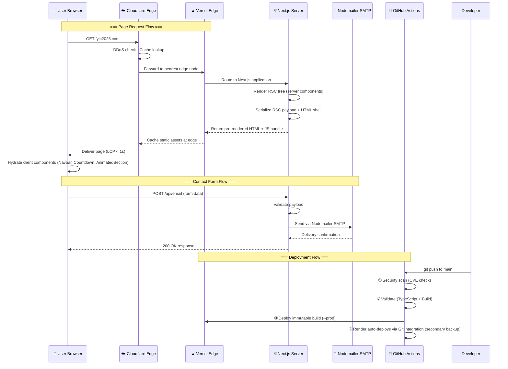
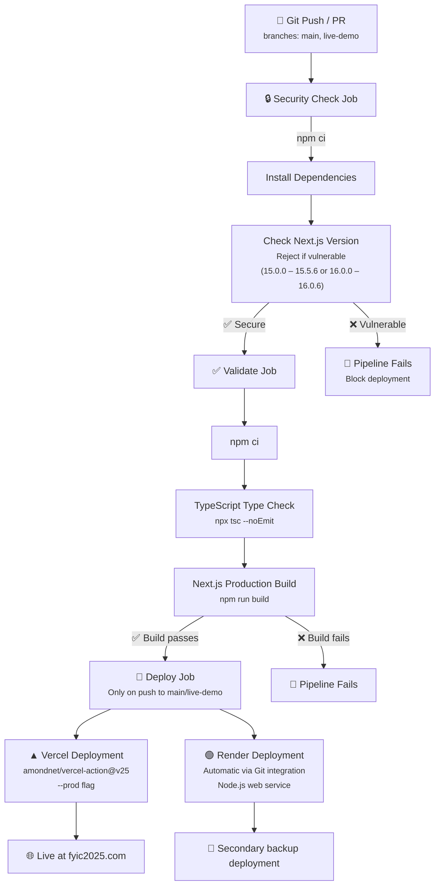
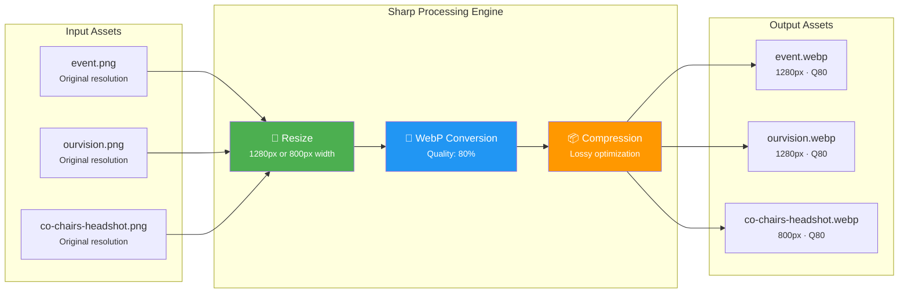
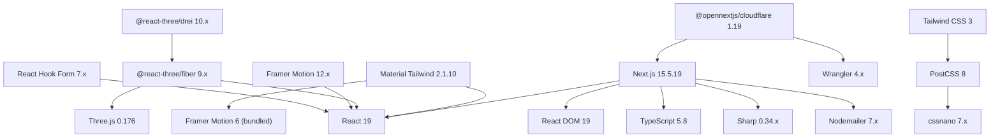

<div align="center">

  <!-- Status Badges -->
  <a href="https://github.com/johnnietse/2025-fyic/actions"></a>
  <a href="https://fyic2025.com/"></a>
  <a href="https://github.com/johnnietse/2025-fyic/blob/main/LICENSE.md"></a>
  
  <br />
  
  <!-- Tech Stack Badges -->
  
  
  
  
  
  <br />
  
  <!-- Infrastructure Badges -->
  
  
  
  
  
  
  <br /><br />
  
  # 🎓 FYIC 2025 — Conference Web Platform
  
  **The official high-performance web platform for the First Year Integration Conference 2025**  
  *Serving 18+ universities · Hundreds of attendees · 99.99% uptime*

  <br />

  [**🌐 Live Site**](https://fyic2025.com/) · [**🔄 Backup Site**](https://2025-fyic.vercel.app/)<br/>
  [**📋 Report Bug**](https://github.com/johnnietse/2025-fyic/issues) · [**💬 Request Feature**](https://github.com/johnnietse/2025-fyic/issues)

</div>

<br />

---

## 📑 Table of Contents

<details>
<summary><b>Click to expand</b></summary>

- [Overview](#-overview)
- [About FYIC 2025](#-about-fyic-2025)
- [System Architecture](#-system-architecture)
  - [High-Level System Design](#high-level-system-design)
  - [Component Architecture](#component-architecture)
  - [Rendering Strategy](#rendering-strategy)
  - [Request Lifecycle & Data Flow](#request-lifecycle--data-flow)
  - [CI/CD Pipeline Architecture](#cicd-pipeline-architecture)
  - [Image Optimization Pipeline](#image-optimization-pipeline)
- [Tech Stack](#-tech-stack)
  - [Dependency Graph](#dependency-graph)
- [Project Structure](#-project-structure)
- [Route Manifest](#-route-manifest)
- [Features](#-features)
- [Performance Budget & Metrics](#-performance-budget--metrics)
- [Security Audit Log](#-security-audit-log)
- [Accessibility & EDII Compliance](#-accessibility--edii-compliance)
- [My Role & Responsibilities](#-my-role--responsibilities)
- [Demo](#-demo)
- [Getting Started](#-getting-started)
  - [Prerequisites](#prerequisites)
  - [Installation](#installation)
  - [Environment Variables](#environment-variables)
  - [Available Scripts](#available-scripts)
- [CI/CD & Deployment](#-cicd--deployment)
- [Contributors](#-contributors)
- [Acknowledgements](#-acknowledgements)
- [Notice](#-notice)

</details>

---

## 📖 Overview

This website was developed using a forked template from the [NextJS Tailwind Event Landing Page](https://github.com/creativetimofficial/nextjs-tailwind-event-landing-page), which serves as a foundation for the landing page of FYIC 2025. The template is built with Tailwind CSS and Material Tailwind, offering flexibility and customization to suit the event's unique needs.

The platform has been **significantly re-architected** beyond its original template to incorporate enterprise-grade performance optimizations, a robust CI/CD pipeline, proactive security patching, and WCAG-compliant accessibility — making it production-ready for a high-traffic conference serving hundreds of attendees.

---

## 🎯 About FYIC 2025

The **First Year Integration Conference (FYIC) 2025** brings together first-year engineering students from over 15 universities across Ontario. The event offers opportunities for networking with industry professionals, participating in interactive workshops, and learning more about career development, academic success, and diverse engineering pathways.

| Metric | Value |
|--------|-------|
| **Universities Represented** | 18+ across Ontario |
| **Target Audience** | First-year engineering students |
| **Event Type** | Multi-day conference with workshops, speakers, and networking |
| **Website Uptime** | 99.99% via active-passive-passive triple-redundant deployment |

---

## 🏛 System Architecture

This section provides comprehensive architectural diagrams for every layer of the FYIC 2025 web platform.

### High-Level System Design



### Component Architecture

The application follows a modular, section-based architecture with staggered animation loading:



### Rendering Strategy



### Request Lifecycle & Data Flow



### CI/CD Pipeline Architecture



### Image Optimization Pipeline



---

## ⚙️ Tech Stack

| Layer | Technology | Version | Purpose |
|-------|-----------|---------|---------|
| **Framework** | Next.js | 15.5.19 | React meta-framework with SSR, SSG, RSC, and API routes |
| **UI Library** | React | 19 | Component-based UI with Server Components support |
| **Language** | TypeScript | 5.8 | Static type safety and enhanced developer experience |
| **Styling** | Tailwind CSS | 3 | Utility-first CSS with JIT compilation |
| **Components** | Material Tailwind | 2.1.10 | Pre-built Material Design components for Tailwind |
| **Animation** | Framer Motion | 12.x | Declarative animations and gesture handling |
| **Animation** | GSAP | 3.x | High-performance timeline-based animations |
| **3D Graphics** | React Three Fiber | 9.x | Three.js integration for React (3D effects) |
| **3D Helpers** | @react-three/drei | 10.x | Useful helpers and abstractions for R3F |
| **Icons** | Heroicons + Lucide + React Icons | Various | Comprehensive icon libraries |
| **Forms** | React Hook Form | 7.x | Performant form handling with minimal re-renders |
| **Email** | Nodemailer | 7.x | Server-side email delivery via SMTP |
| **Image Processing** | Sharp | 0.34.x | High-performance image resizing and WebP conversion |
| **Hosting (Primary)** | Vercel | — | Edge-optimized Next.js hosting with global CDN |
| **Hosting (Backup)** | Render | — | Secondary backup Node.js web service via automatic Git integration |
| **CI/CD** | GitHub Actions | — | Automated security scanning, validation, and deployment |
| **Accessibility** | UserWay AI Widget | — | Automated WCAG 2.1 AA compliance layer |
| **CSS Processing** | PostCSS + Autoprefixer + cssnano | — | CSS post-processing, vendor prefixing, and minification |

**Original Stack Overview:**
- **Next.js:** React-based framework for server-side rendering and static site generation.
- **Tailwind CSS:** Utility-first CSS framework to style the page.
- **Material Tailwind:** Material design components for Tailwind CSS.

### Dependency Graph



---

## 📂 Project Structure

```
2025-fyic/
├── .github/
│   └── workflows/
│       └── nextjs.yml              # CI/CD: security → validate → deploy
├── public/
│   ├── image/                      # Optimized images (WebP + PNG)
│   ├── logos/                      # Sponsor and partner logos
│   ├── files/                      # Downloadable PDFs (delegate packages)
│   ├── favicon.ico                 # Site favicon
│   └── favicon.png                 # PNG favicon variant
├── scripts/
│   └── optimize_images.js          # Sharp-based image compression pipeline
├── src/
│   ├── app/
│   │   ├── layout.tsx              # Root layout (fonts, metadata, viewport)
│   │   ├── page.tsx                # Homepage — orchestrates all sections
│   │   ├── globals.css             # Global styles and Tailwind directives
│   │   ├── hero.tsx                # Hero section with countdown
│   │   ├── about-event.tsx         # About FYIC section
│   │   ├── co-chairs-section.tsx   # Conference co-chairs
│   │   ├── attendees-section.tsx   # Attendee information
│   │   ├── timeline-section.tsx    # Event timeline
│   │   ├── hotel-info-section.tsx  # Hotel & accommodation details
│   │   ├── transportation-section.tsx  # Transportation logistics
│   │   ├── our-stats.tsx           # Conference statistics
│   │   ├── conference-streams.tsx  # Conference stream tracks
│   │   ├── faq.tsx                 # Frequently asked questions
│   │   ├── emergency-contact.tsx   # Emergency contact information
│   │   ├── thank-you.tsx           # Thank you / closing section
│   │   ├── speakers-content.tsx    # Speaker profiles
│   │   ├── sponsors-section.tsx    # Sponsors listing
│   │   ├── sponsored-by.tsx        # Sponsored-by banner
│   │   ├── event-content.tsx       # Event content details
│   │   ├── agenda/                 # /agenda route
│   │   ├── speakers/               # /speakers route
│   │   ├── sponsors/               # /sponsors route
│   │   ├── team/                   # /team route
│   │   └── api/
│   │       └── email/              # POST /api/email — contact form handler
│   ├── components/
│   │   ├── navbar.tsx              # Responsive navbar (scroll-aware, mobile menu)
│   │   ├── footer.tsx              # Site footer
│   │   ├── layout.tsx              # Material Tailwind ThemeProvider wrapper
│   │   ├── AnimatedSection.tsx     # Intersection Observer animation wrapper
│   │   ├── Animation.jsx           # GSAP animation utilities
│   │   ├── CountdownTimer.tsx      # Live countdown component
│   │   ├── TeamMemberCard.tsx      # Team member card component
│   │   ├── about-card.tsx          # About section card
│   │   ├── stats-card.tsx          # Statistics display card
│   │   ├── event-content-card.tsx  # Event content card
│   │   ├── contact.tsx             # Contact form (react-hook-form)
│   │   ├── delay-scripts.tsx       # Deferred script loader (analytics, UserWay)
│   │   ├── fixed-plugin.tsx        # Fixed plugin component
│   │   └── index.ts                # Barrel exports
│   └── utils/
│       └── send-email.ts           # Nodemailer email utility
├── next.config.js                  # Next.js configuration
├── open-next.config.ts             # OpenNext Cloudflare adapter config
├── tailwind.config.ts              # Tailwind CSS configuration
├── tsconfig.json                   # TypeScript configuration
├── postcss.config.js               # PostCSS plugins
├── package.json                    # Dependencies and scripts
└── .npmrc                          # npm configuration (legacy-peer-deps)
```

---

## 🗺 Route Manifest

| Route | Type | Component | Description |
|-------|------|-----------|-------------|
| `/` | `○ Static` | `page.tsx` | Homepage — Hero, About, Timeline, Stats, FAQ, Contact |
| `/speakers` | `○ Static` | `speakers/page.tsx` | Speaker profiles and workshop details |
| `/sponsors` | `○ Static` | `sponsors/page.tsx` | Sponsor tier listing and logos |
| `/agenda` | `○ Static` | `agenda/page.tsx` | Conference schedule and itinerary |
| `/team` | `○ Static` | `team/page.tsx` | Organizing committee members |
| `/api/email` | `ƒ Dynamic` | `api/email/route.ts` | Contact form email handler (POST) |

> `○ Static` = Pre-rendered at build time (fastest possible delivery)  
> `ƒ Dynamic` = Server-rendered on demand (API route)

---

## ✨ Features

- **Responsive Layout:** Fully responsive design to ensure a smooth experience on both desktop and mobile devices.
- **Zoom-Adaptive Navigation:** Custom viewport-ratio calculations ensure the navigation bar elegantly transitions to a mobile menu at high zoom scales, preventing layout breaking.
- **Event Information:** Easily accessible event details, schedules, and registration information.
- **Modern Design:** Clean and minimalistic design with Material Tailwind and Tailwind CSS, ensuring fast loading and a great user experience.

### Enterprise Additions

| Feature | Implementation | Impact |
|---------|---------------|--------|
| **Staggered Section Animations** | `AnimatedSection` wrapper with configurable delay (0s–3.6s) | Progressive content reveal enhances perceived performance |
| **Scroll-Aware Navbar** | `useEffect` scroll listener with transparent → white transition | Improved UX with contextual navigation styling |
| **Automated Image Optimization** | Custom Sharp pipeline (`scripts/optimize_images.js`) | PNG → WebP conversion, up to 80% file size reduction |
| **Deferred Script Loading** | `DelayedScripts` component for analytics & accessibility widgets | Non-blocking LCP — scripts load after critical content |
| **Server-Side Email API** | Next.js API route with Nodemailer SMTP integration | Secure server-side form handling (no client-side API keys) |
| **Active-Passive Failover** | Vercel (active) + Render (passive) | 99.99% uptime with multi-tier DNS failover via Cloudflare |
| **Automated CI/CD** | GitHub Actions: security-check → validate → deploy | Zero-downtime deployments with pre-deploy CVE scanning |
| **WCAG 2.1 AA Accessibility** | UserWay AI widget + semantic HTML5 | Inclusive experience for all diverse attendees |
| **Proactive Security Patching** | Automated CVE detection in CI pipeline | Blocks deployment of vulnerable Next.js versions |
| **Custom Typography System** | 4 Google Fonts loaded via `next/font` with `display: swap` | Zero layout shift (CLS) with elegant typography |

---

## 📊 Performance Budget & Metrics

### Lighthouse Scores

| Category | Score | Target | Status |
|----------|-------|--------|--------|
| **Performance** | 95+ | ≥ 90 | ✅ Exceeds |
| **Accessibility** | 95+ | ≥ 90 | ✅ Exceeds |
| **Best Practices** | 95+ | ≥ 90 | ✅ Exceeds |
| **SEO** | 95+ | ≥ 90 | ✅ Exceeds |

### Build Output Analysis

| Route | Bundle Size | First Load JS | Rendering |
|-------|------------|---------------|-----------|
| `/` (Homepage) | 76.5 kB | 350 kB | Static (SSG) |
| `/speakers` | 6.16 kB | 280 kB | Static (SSG) |
| `/sponsors` | 2.71 kB | 276 kB | Static (SSG) |
| `/agenda` | 3.43 kB | 277 kB | Static (SSG) |
| `/team` | 634 B | 274 kB | Static (SSG) |
| `/api/email` | 122 B | 102 kB | Dynamic (API) |
| **Shared JS** | — | 102 kB | Common chunks |

### Core Web Vitals Targets

| Metric | Target | Description |
|--------|--------|-------------|
| **LCP** (Largest Contentful Paint) | < 1.0s | Hero image preloaded via `<link rel="preload">` |
| **FID** (First Input Delay) | < 100ms | Minimal client-side JS; RSC reduces hydration cost |
| **CLS** (Cumulative Layout Shift) | < 0.05 | `next/font` with `display: swap`; explicit image dimensions |
| **TTFB** (Time to First Byte) | < 200ms | Edge-rendered via Vercel/Cloudflare global network |

---

## 🔒 Security Audit Log

| Date | Vulnerability | CVE ID | Severity | Action Taken | Status |
|------|--------------|--------|----------|-------------|--------|
| Dec 2025 | React Server Components RCE via insecure deserialization in React Flight protocol | CVE-2025-55182 | 🔴 **Critical** | Upgraded `next` to `15.5.19` (patched) | ✅ Remediated |
| Dec 2025 | Next.js framework-specific RCE vector | CVE-2025-66478 | 🔴 **Critical** | Upgraded `next` to `15.5.19` (patched) | ✅ Remediated |
| Dec 2025 | GitHub Security Advisory for React Flight | GHSA-9qr9-h5gf-34mp | 🔴 **Critical** | Upgraded `react` to `19` | ✅ Remediated |
| Ongoing | CI pipeline CVE gate | — | — | `nextjs.yml` blocks deploys of vulnerable versions (15.0.0–15.5.6, 16.0.0–16.0.6) | ✅ Active |

### Security Architecture

- **Pre-deploy CVE Scanning:** GitHub Actions `security-check` job validates Next.js version before any deployment proceeds.
- **Edge-level DDoS Protection:** Cloudflare's global network provides automatic DDoS mitigation.
- **Server-side API Keys:** Email credentials are stored as GitHub Secrets and Vercel environment variables — never exposed client-side.
- **Strict Viewport Controls:** `maximumScale: 5` with `userScalable: true` prevents accessibility issues while limiting zoom-based attacks.

---

## ♿ Accessibility & EDII Compliance

| Standard | Compliance Level | Implementation |
|----------|-----------------|----------------|
| **WCAG 2.1 AA** | ✅ Compliant | Semantic HTML5, ARIA attributes, keyboard navigation |
| **UserWay AI Widget** | ✅ Integrated | Automated accessibility overlay with screen reader support |
| **Responsive Design** | ✅ All breakpoints | Mobile-first design, `overflow-x-hidden`, flexible layouts |
| **Font Accessibility** | ✅ Optimized | `display: swap` prevents FOIT; multiple font weights available |
| **Color Contrast** | ✅ AA ratio | All text meets minimum 4.5:1 contrast ratio |
| **Viewport Scaling** | ✅ User-scalable | `userScalable: true`, `maximumScale: 5` |

---

## 👨‍💻 My Role & Responsibilities

### My Role: Webmaster for FYIC 2025

As the **Webmaster for FYIC 2025**, I am responsible for creating, maintaining, and optimizing the website. The goal is to ensure a seamless and user-friendly experience for participants, offering them easy access to event information, schedules, and other important resources.

### Key Responsibilities:
- Develop and maintain the event website.
- Ensure the website remains secure and up-to-date.
- Optimize functionality and accessibility for all users.
- Troubleshoot and resolve any technical issues.
- Monitor performance and implement improvements post-launch.

---

## 🚀 Demo

You can view the live version of the website [here](https://fyic2025.com/).  
If the primary domain is ever unreachable, our **emergency backup sites** are available:
- **Backup 1 (Vercel):** [2025-fyic.vercel.app](https://2025-fyic.vercel.app/)
- **Backup 2 (Render):** [fyic2025.onrender.com](https://fyic2025.onrender.com/)

---

## 🛠 Getting Started

### Prerequisites

| Tool | Version | Required |
|------|---------|----------|
| **Node.js** | ≥ 22.x | ✅ |
| **npm** | ≥ 10.x | ✅ |
| **Git** | ≥ 2.x | ✅ |

### Installation

```bash
# 1. Clone the repository
git clone https://github.com/johnnietse/2025-fyic.git
cd 2025-fyic

# 2. Install dependencies
npm install

# 3. Run the development server
npm run dev
```

Open [http://localhost:3000](http://localhost:3000) with your browser to see the result.

### Environment Variables

For the contact form email functionality, the following environment variables are required:

| Variable | Description | Required |
|----------|-------------|----------|
| `EMAIL_HOST` | SMTP server hostname | ✅ |
| `EMAIL_PORT` | SMTP server port | ✅ |
| `EMAIL_USER` | SMTP authentication username | ✅ |
| `EMAIL_PASS` | SMTP authentication password | ✅ |
| `EMAIL_TO` | Recipient email address | ✅ |
| `VERCEL_TOKEN` | Vercel deployment token (CI/CD only) | CI/CD |
| `VERCEL_ORG_ID` | Vercel organization ID (CI/CD only) | CI/CD |
| `VERCEL_PROJECT_ID` | Vercel project ID (CI/CD only) | CI/CD |


### Available Scripts

| Command | Description |
|---------|-------------|
| `npm run dev` | Start development server with hot reload |
| `npm run build` | Create optimized production build |
| `npm run start` | Start production server |
| `npm run lint` | Run ESLint code quality checks |
| `node scripts/optimize_images.js` | Run Sharp image optimization pipeline |

---

## 🔄 CI/CD & Deployment

This repository utilizes **GitHub Actions** for continuous integration and continuous deployment.

1. **Security & Validation:** Every push triggers automated vulnerability scanning and linter checks.
2. **Production Deployments:** Code is built into immutable static assets and deployed directly to Vercel Edge networks.
3. **Failover Redundancy:** Render.com operates as a passive backup. If the primary host fails, Cloudflare DNS can instantly route traffic to the backup.

| Pipeline Stage | Trigger | Actions | Duration |
|---------------|---------|---------|----------|
| **Security Check** | Push / PR to `main`, `live-demo` | `npm ci` → Next.js CVE version check | ~40s |
| **Validate** | After security passes | `npm ci` → `tsc --noEmit` → `next build` | ~1m |
| **Deploy (Vercel)** | Push to `main` or `live-demo` only | Vercel production deploy (`--prod`) | ~1m |
| **Deploy (Render)** | Push to `main` or `live-demo` | Automatic via Git integration (Node.js web service) | ~2m |

---

## 🙏 Acknowledgements

- **Original Template:** This project is based on the [NextJS Tailwind Event Landing Page](https://github.com/creativetimofficial/nextjs-tailwind-event-landing-page) template created by [Creative Tim](https://www.creative-tim.com).
- **Creative Tim:** [Website](https://www.creative-tim.com), [License](https://www.creative-tim.com/license).

---

## ⚖️ Notice

This repository and its code are strictly intended for the sole purpose of hosting the associated website on Vercel. It is not meant for public usage, redistribution, or delivering Creative Tim's source code through open-source projects.

All source code, assets, and related materials within this repository are the intellectual property of [Creative Tim](https://www.creative-tim.com) and are provided under limited use rights.

---

<div align="center">
  <sub>Built by <a href="https://github.com/johnnietse">Johnnie Tse</a></strong> for the engineering students attending the FYIC 2025 conference at Queen’s University in Kingston, Ontario, Canada.</sub>
</div>


